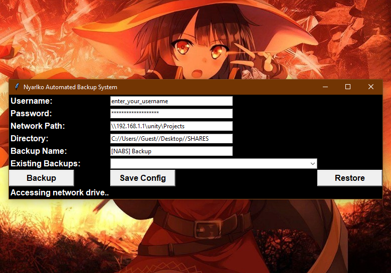

# Nyarlko-Network-Backup-Restore
* Backup / Restore certain folder as zip file to network location. EG: backup / restore whole unity project with single click.
* Usage:
```sh
  Run the app as administrator.
  Enter neccesary info for connecting share and backup location.
 ```
 * Screen Shots:
<p align="center">
  <a href=https://github.com/ny4rlk0/Nyarlko-Network-Backup-Restore/">
    
  </a>
